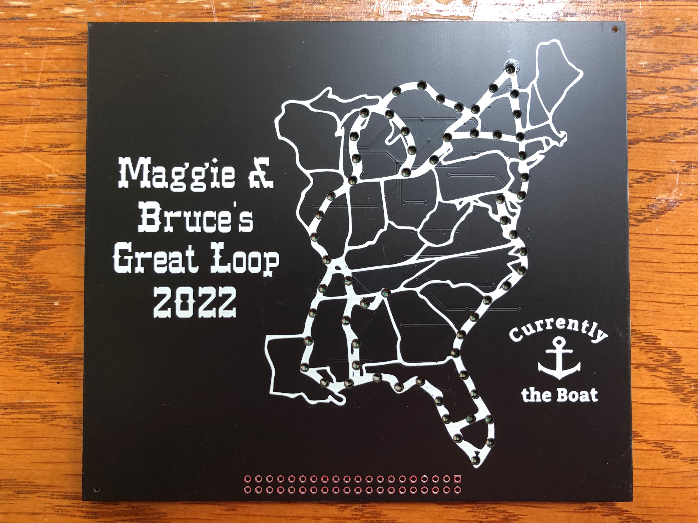
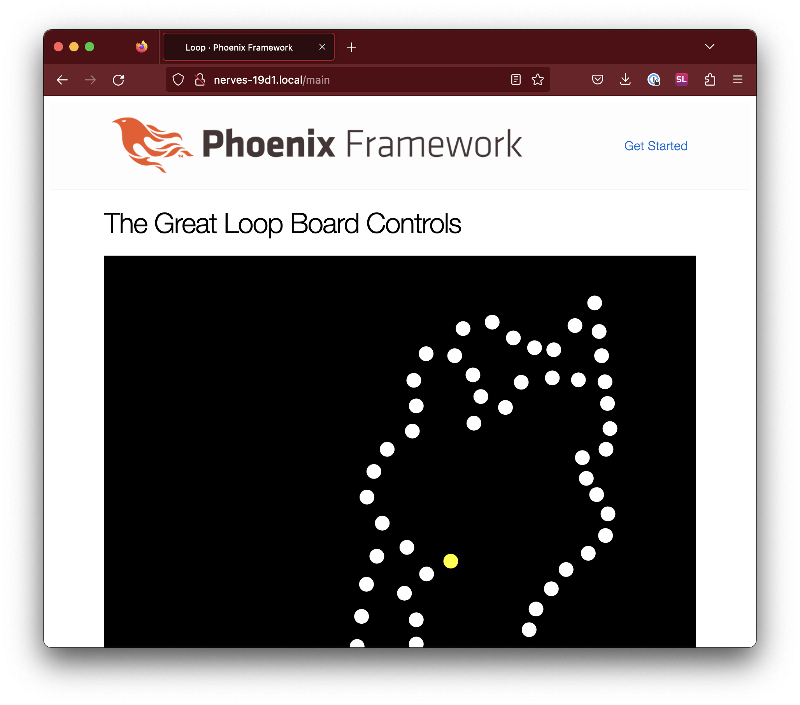
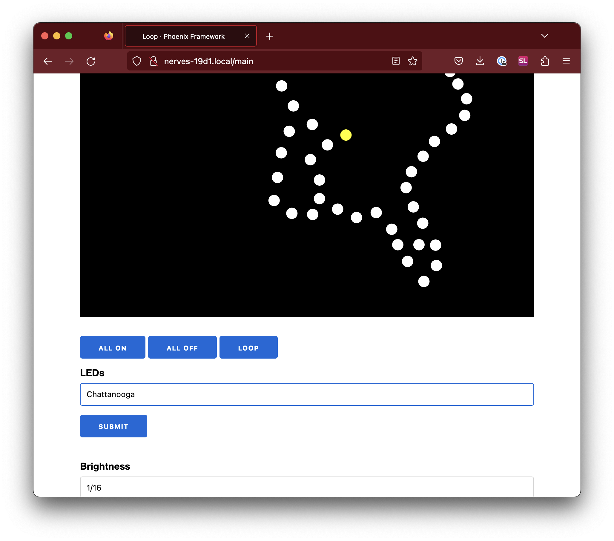
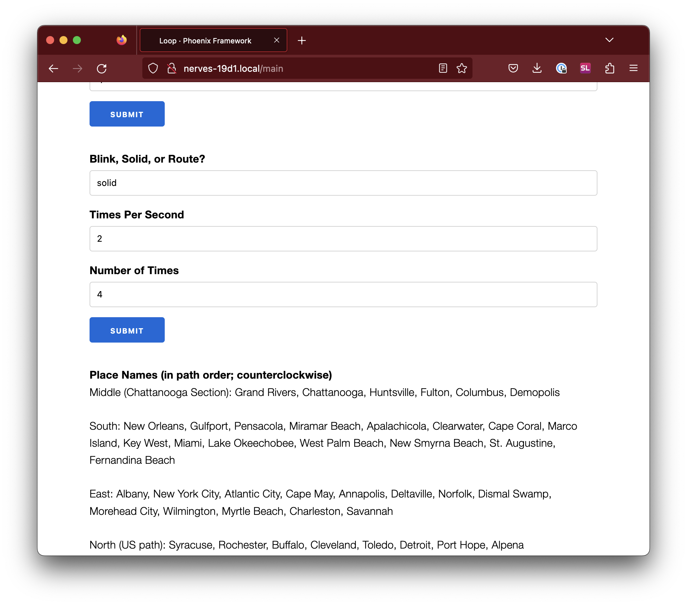
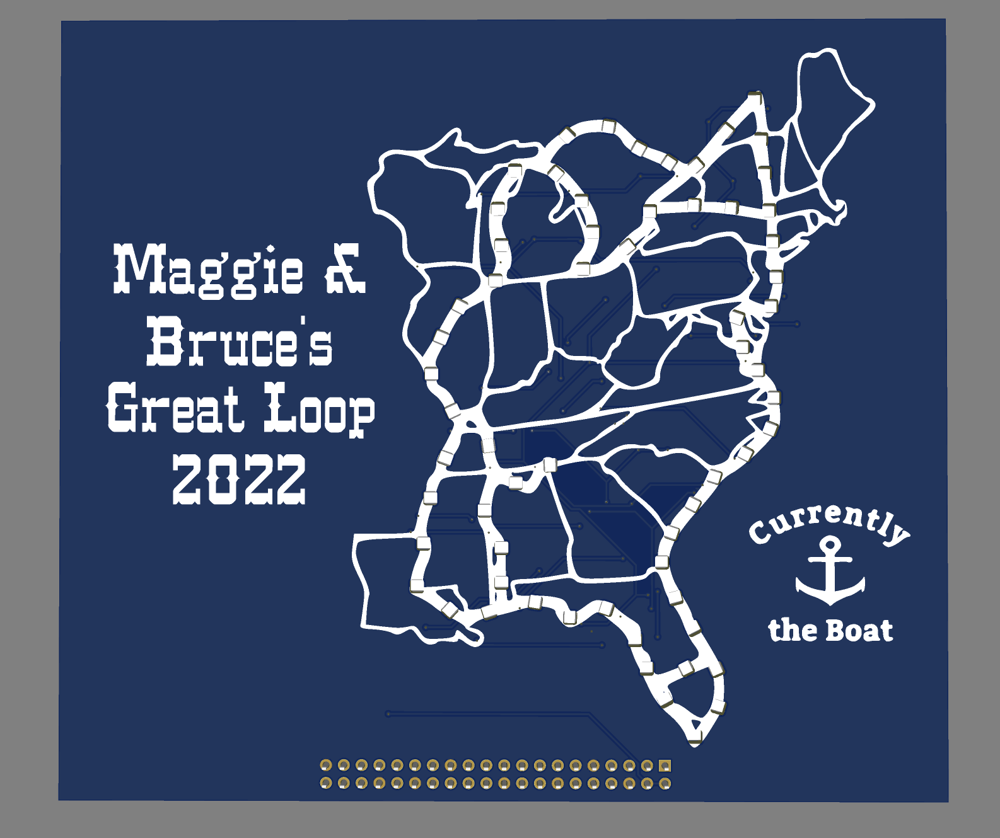
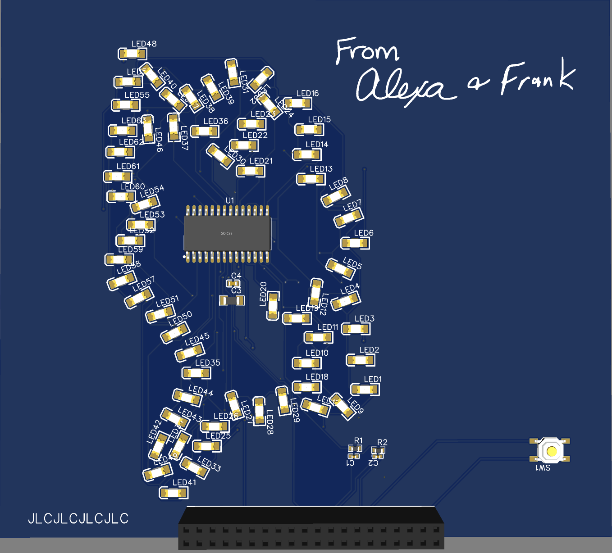

# The Great Loop PCB

In 2022, our friends Bruce and Maggie decided to drive their boat around the
[Great Loop](https://www.greatloop.org/) and visit us along the way. They
documented their journey at [Currently The
Boat](https://www.currentlytheboat.com/). Since it was going to take them 6
months to reach us, it seemed like plenty of time to design a custom PCB with
LEDs to show their route. Since Bruce is a big fan of Elixir, the project is
controlled by a Raspberry Pi running Nerves with an Elixir LiveView user
interface.



## Software overview

This is an Elixir project that uses the following:

* [Nerves](https://nerves-project.org/)
* [Phoenix LiveView](https://www.phoenixframework.org/)
* [Surface](https://surface-ui.org/)
* [Circuits.SPI](https://elixir-circuits.github.io/)

The Raspberry Pi runs a Nerves project that starts Phoenix. We used Surface for
the user interface. Circuits.SPI was used to communicate with the LED driver
chip, the [TM1640](hw/TM1640.pdf).

## Building

```sh
cd loop
mix deps.get
mix assets.deploy
cd ../loop_fw
export MIX_TARGET=rpi0  # or rpi3a or whatever board you're using
mix deps.get
mix firmware
```

## Loading firmware

To create the MicroSD card for the first time:

```sh
cd loop_fw
mix firmware.burn
```

The next times:

```sh
# Run this line if you don't have ./upload.sh
mix firmware.gen.script
# Upload the firmware over ssh
./upload.sh
```

## Using

Visit http://your_device_name.local/main to access the controls for the board.



Below the display, there are forms and buttons to turn LEDs on and off, make them blink and turn them on in a path. The LEDs are referred to by their place names and separated by commas.



The names of the LEDs are located at the bottom of the page.



## Hardware

We used [EasyEDA](https://easyeda.com/) for creating the schematics and ordered
boards through [JLCPCB](https://jlcpcb.com/). We also had JLCPCB do the
assembly. You can view a [pdf of the schematics](hw/schematic_great_loop.pdf) or
look at its [OSHWLab project](https://oshwlab.com/fhunleth/binary_clock2_copy).




## License

The code for this project is licensed under the Apache License, Version 2.0.
